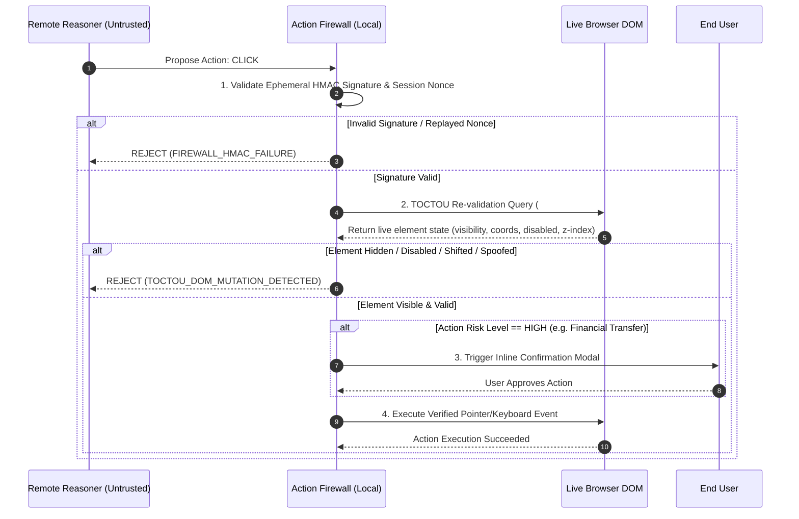

# FINAL SIH ARCHITECTURE SLIDE SPEC & DIAGRAM MASTER
## On-Device Visual Perception & Action-Gated Security Architecture (PS 26171)

> **REVISION**: 1.0 (CODE-FROZEN AUDITED STATE)  
> **PURPOSE**: Master visual specification, architecture diagrams, dataflow specs, and file traceability map for SIH presentation slides and technical judging panels.

---

### SECTION 1: HIGH-LEVEL SYSTEM ARCHITECTURE (MERMAID DIAGRAM)

```mermaid
flowchart TD
    subgraph BROWSER_ISOLATED_WORLD["Chrome Extension Content Script (Isolated World)"]
        A["Rendered Webpage Viewport<br/>(DOM + Canvas + WebGL)"] -->|1. Event Trigger| B["Viewport Capture Request"]
        B -->|2. Request Capture + Fresh Nonce| C["Background Service Worker"]
        
        subgraph LOCAL_VISUAL_AI_ENGINE["Local Visual AI Subsystem (WASM)"]
            E["Tesseract WASM OCR Engine<br/>(Worker Thread)"]
            F["Local PII Detector<br/>(Regex + Spatial BBox)"]
            G["Solid Dark-Fill Canvas Redactor<br/>(#020617 Opaque Rectangles)"]
            E --> F
            F --> G
        }
        
        D -->|4. Raw Viewport Pixel Buffer| E
        G -->|5. Redacted Image + Tokenized DOM| H["Local Egress Validator"]
    end

    subgraph BACKGROUND_SERVICE_WORKER["Background Service Worker (Privileged Context)"]
        C -->|3. chrome.tabs.captureVisibleTab| D["Tab Screenshot Data URL"]
        C -->|Sign Action Nonce| I["Ephemeral Session HMAC Key"]
    end

    subgraph UNTRUSTED_REMOTE_REASONER["Remote Advisory Planner (Cloud / Server)"]
        H -->|6. Egress Safe Payload| J["Remote Reasoner / VLM"]
        J -->|7. Unauthenticated Action Proposal| K["Action Proposal Payload"]
    end

    subgraph ACTION_FIREWALL_GATE["Client-Side Action Firewall (Isolated World)"]
        K --> L{"Local Action Firewall"}
        I -.->|Validate HMAC Token| L
        L -->|TOCTOU Check: DOM Re-validation| M{"Is Action Safe & Valid?"}
        M -->|YES| N["Execute Verified DOM Action"]
        M -->|NO / TAMPERED| O["ABORT & Block Action<br/>(Log Violation)"]
    end

    style BROWSER_ISOLATED_WORLD fill:#0f172a,stroke:#38bdf8,stroke-width:2px,color:#fff
    style LOCAL_VISUAL_AI_ENGINE fill:#1e1b4b,stroke:#818cf8,stroke-width:2px,color:#fff
    style BACKGROUND_SERVICE_WORKER fill:#14532d,stroke:#22c55e,stroke-width:2px,color:#fff
    style UNTRUSTED_REMOTE_REASONER fill:#451a03,stroke:#f97316,stroke-width:2px,color:#fff
    style ACTION_FIREWALL_GATE fill:#4c0519,stroke:#fb7185,stroke-width:2px,color:#fff
```

---

### SECTION 2: TRUST BOUNDARY DEFINITIONS

| COMPONENT | PRIVILEGE LEVEL | TRUST STATUS | RESPONSIBILITY & SECURITY BOUNDARY |
| :--- | :--- | :--- | :--- |
| **Webpage DOM** | User Context | **UNTRUSTED (Adversarial)** | May contain malicious scripts, visual spoofing, prompt injection, or dynamic layout mutations. |
| **Content Script** | Extension Isolated World | **SEMI-TRUSTED** | Executes DOM extraction, invokes local OCR worker, applies `#020617` canvas redaction. Cannot issue raw `captureVisibleTab`. |
| **Tesseract WASM** | Dedicated Web Worker | **LOCAL TRUSTED** | Executes pixel-level OCR locally in memory. Zero external network transmission during inference. |
| **Service Worker** | Chrome Runtime Background | **HIGHLY TRUSTED** | Authoritative capture provider (`chrome.tabs.captureVisibleTab`). Issues & validates single-use capture nonces. |
| **Egress Validator** | Content Script Gatekeeper | **HIGHLY TRUSTED** | Performs fail-closed string scanning on outgoing JSON. Rejects payloads containing unredacted PII. |
| **Remote Reasoner** | External Server | **UNTRUSTED ADVISORY** | Generates high-level task plans and action proposals. Has zero direct execution privilege in browser. |
| **Action Firewall** | Local Execution Gatekeeper | **HIGHLY TRUSTED** | Verifies action HMAC, checks TOCTOU DOM state, enforces user confirmation for high-risk operations. |

---

### SECTION 3: VISUAL PERCEPTION ENGINE SPECIFICATIONS

```
+-------------------------------------------------------------------------------+
|                       LOCAL VISUAL AI INFERENCE SPEC                          |
+-------------------------------------------------------------------------------+
| Engine Architecture   | Tesseract 5.x compiled to WebAssembly (WASM Core)     |
| Execution Context     | Dedicated Web Worker (`tesseract-worker.js`)          |
| Input Buffer          | Raw base64 DataURL -> HTML5 Canvas Pixel ImageData    |
| Output Schema         | Bounding Box array: `[{ text, bbox: [x,y,w,h], conf }]`|
| Processing Time       | 350ms - 550ms per 1080p Viewport Capture              |
| Memory Footprint      | ~42MB WASM Heap (Freed post-inference pass)           |
| Weight Storage        | Remote fetch on 1st run (`eng.traineddata.gz`),       |
|                       | cached in IndexedDB for 100% offline subsequent runs  |
+-------------------------------------------------------------------------------+
```

---

### SECTION 4: PRIVACY REDACTION DATAFLOW & CANVAS REDACTION SPEC

```
UNREDACTED VIEWPORT SCREENSHOT
  |
  +---> [LocalPIIDetector] ---> Scans DOM text + Visual OCR BBoxes
  |                                   |
  |                                   v
  |                             Identifies PII BBoxes:
  |                             - Credit Card: [x:140, y:320, w:200, h:30]
  |                             - SSN:         [x:140, y:380, w:150, h:30]
  |                                   |
  +-----------------------------------+
  |
  v
[HTML5 Canvas In-Memory Redactor]
  |
  +---> `ctx.fillStyle = '#020617'` (Solid Opaque Hex Color)
  +---> `ctx.fillRect(140, 320, 200, 30)`
  +---> `ctx.fillRect(140, 380, 150, 30)`
  |
  v
REDACTED SCREENSHOT DATA URL (PII mathematically non-recoverable)
  |
  v
[Local EgressValidator] ---> Fail-closed string validation scan
  |
  +---> PASS: Transmit to Remote Reasoner
  +---> FAIL: ABORT & Log `EGRESS_VIOLATION_BLOCKED`
```

---

### SECTION 5: ACTION FIREWALL & TOCTOU PROTECTION SEQUENCE (MERMAID)



---

### SECTION 6: FILE MAPPING & SOURCE CODE TRACEABILITY MATRIX

| ARCHITECTURAL COMPONENT | PRODUCTION SOURCE FILE | PRIMARY CLASS / FUNCTION |
| :--- | :--- | :--- |
| **Capture Orchestration** | [content_script.ts](file:///c:/Users/Anvesha/OneDrive/Desktop/SIH_2.0/extension/src/content/content_script.ts) | `captureAndAnalyzeViewport()` |
| **Secure Capture Service** | [service_worker.ts](file:///c:/Users/Anvesha/OneDrive/Desktop/SIH_2.0/extension/src/background/service_worker.ts) | `handleCaptureVisibleTab()` |
| **Local WASM OCR Engine** | [visual_ocr_engine.ts](file:///c:/Users/Anvesha/OneDrive/Desktop/SIH_2.0/extension/src/privacy/visual_ocr_engine.ts) | `LocalVisualModelEngine.recognizePixels()` |
| **Perception Fusion** | [visual_detector.ts](file:///c:/Users/Anvesha/OneDrive/Desktop/SIH_2.0/extension/src/privacy/visual_detector.ts) | `detectMultimodalEntities()` |
| **PII & Canvas Redactor** | [pii_detector.ts](file:///c:/Users/Anvesha/OneDrive/Desktop/SIH_2.0/extension/src/privacy/pii_detector.ts) | `LocalPIIDetector.redactScreenshot()` |
| **Egress Boundary Control** | [egress_validator.ts](file:///c:/Users/Anvesha/OneDrive/Desktop/SIH_2.0/extension/src/privacy/egress_validator.ts) | `EgressValidator.validatePayload()` |
| **Action Firewall Gate** | [action_firewall.ts](file:///c:/Users/Anvesha/OneDrive/Desktop/SIH_2.0/extension/src/firewall/action_firewall.ts) | `ActionFirewall.verifyAndExecuteAction()` |
| **Canvas Capture Utils** | [canvas_capture.ts](file:///c:/Users/Anvesha/OneDrive/Desktop/SIH_2.0/extension/src/content/canvas_capture.ts) | `extractCanvasImageData()` |

---

> **END OF ARCHITECTURE SLIDE SPEC**
