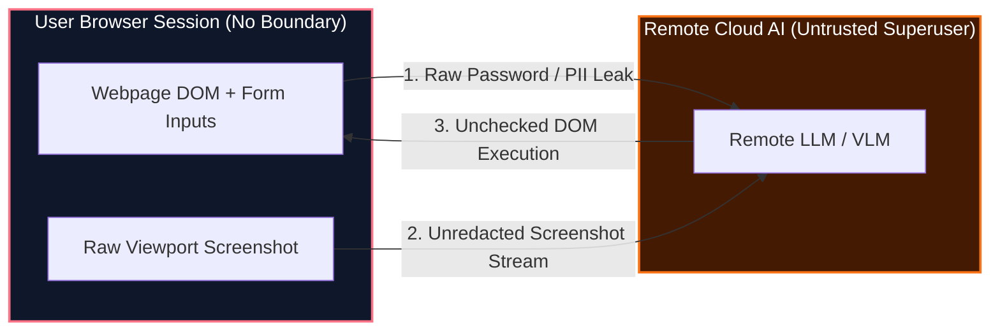
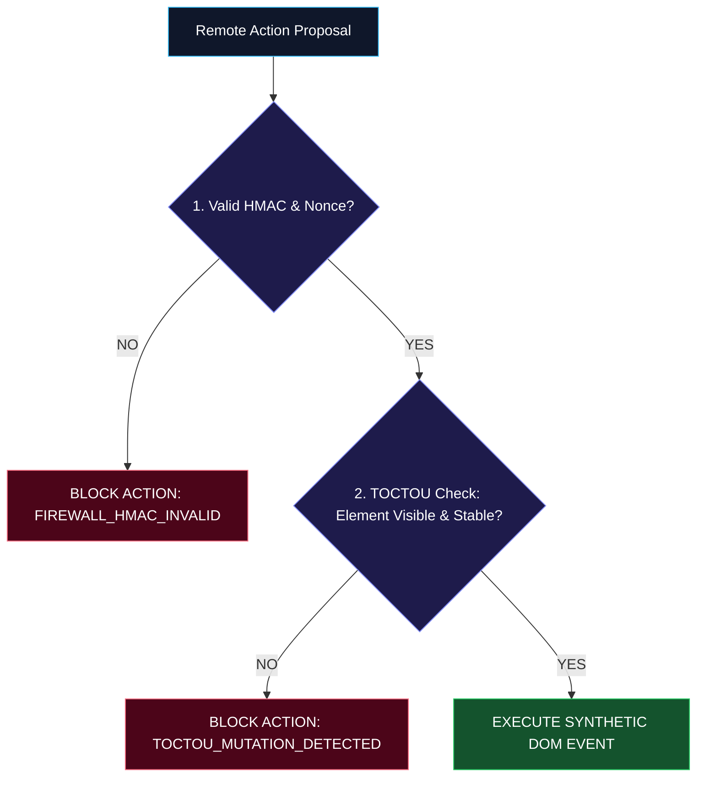

# FINAL SIH 2026 PPT VISUAL SPECIFICATION & DIAGRAM MASTER
## Visual Layout, Color Palette, Typography & Mermaid Diagram Specs (PS 26171)

> **REVISION**: 1.0 (CODE-FROZEN AUDITED STATE)  
> **PURPOSE**: Complete graphic design, layout wireframe, color system, and Mermaid diagram specification for building competition slides.

---

### SECTION 1: GLOBAL BRAND & COLOR SYSTEM

```
+-----------------------------------------------------------------------------------+
| COLOR NAME           | HEX CODE  | ROLE & USAGE IN SLIDES                         |
+-----------------------------------------------------------------------------------+
| Slate Background     | #020617   | Primary slide background (Dark Midnight Slate) |
| Card Container       | #0f172a   | Floating visual container / component card     |
| Border Accent        | #1e293b   | Card borders & structural dividing lines       |
| Primary Sky Blue     | #38bdf8   | Extension Isolated World / Client Trust Zone   |
| Security Emerald     | #22c55e   | Passed checks, redacted status, safe egress    |
| Threat Rose Red      | #fb7185   | Privacy leaks, prompt injections, blocked logs |
| Indigo AI Accent     | #818cf8   | Local WebAssembly OCR & Web Worker threads     |
| Advisory Orange      | #f97316   | Untrusted Remote Reasoner / Advisory Planner   |
| Primary Text White   | #f8fafc   | Headers, key metrics, slide titles             |
| Muted Body Gray      | #94a3b8   | Supporting text, captions, doc references      |
+-----------------------------------------------------------------------------------+
```

---

### SECTION 2: MERMAID DIAGRAM SPECIFICATIONS

#### SLIDE 2 DIAGRAM: CONVENTIONAL UNSAFE ARCHITECTURE



---

#### SLIDE 3 DIAGRAM: OUR BIDIRECTIONAL TRUST BOUNDARY ARCHITECTURE

```mermaid
flowchart TD
    subgraph CLIENT_TRUST_ZONE["Chrome Extension Isolated World (Client Trust Zone)"]
        A["Rendered Viewport"] --> B["Local WASM OCR Worker"]
        B --> C["Local PII Detector"]
        C --> D["Solid #020617 Canvas Redactor"]
        D --> E["Local Egress Validator"]
    end

    subgraph REMOTE_UNTRUSTED["Untrusted Remote Advisory Planner"]
        F["Remote Reasoner"]
    end

    subgraph ACTION_GATE["Client-Side Action Firewall"]
        G["HMAC Nonce Validator"] --> H["TOCTOU DOM Re-query"] --> I["Execute DOM Event"]
    end

    E -->|Sanitized JSON (0 PII)| F
    F -->|Action Proposal| G

    style CLIENT_TRUST_ZONE fill:#0f172a,stroke:#38bdf8,stroke-width:2px,color:#fff
    style REMOTE_UNTRUSTED fill:#451a03,stroke:#f97316,stroke-width:2px,color:#fff
    style ACTION_GATE fill:#1e1b4b,stroke:#22c55e,stroke-width:2px,color:#fff
```

---

#### SLIDE 4 DIAGRAM: LOCAL VISUAL PRIVACY PIPELINE


---

#### SLIDE 5 DIAGRAM: ACTION FIREWALL & TOCTOU GATING SEQUENCE



---

### SECTION 3: SLIDE LAYOUT WIREFRAMES (ASCII SPEC)

```
+-----------------------------------------------------------------------------------+
| SLIDE 6 LAYOUT WIREFRAME — LIVE EVIDENCE GRID                                     |
+-----------------------------------------------------------------------------------+
| HEADER: EMPIRICAL RUNTIME EVIDENCE & DEVTOOLS AUDIT TRACES                        |
|                                                                                   |
| +-----------------------------------+   +-----------------------------------+ |
| | FRAME 1: LOCAL WASM WORKER        |   | FRAME 2: ZERO RAW PII EGRESS      | |
| | DevTools Application/Threads      |   | DevTools Network Payload JSON     | |
| | [tesseract-worker.js active]      |   | ["card": "[REDACTED_CARD_1]"]     | |
| +-----------------------------------+   +-----------------------------------+ |
|                                                                                   |
| +-----------------------------------+   +-----------------------------------+ |
| | FRAME 3: CANVAS #020617 REDACTION |   | FRAME 4: ACTION FIREWALL BLOCK    | |
| | Base64 Image Payload Preview      |   | Console Log: FIREWALL_HMAC_INVALID| |
| | [Solid black rectangles over PII] |   | [Red Security Warning Badge]      | |
| +-----------------------------------+   +-----------------------------------+ |
+-----------------------------------------------------------------------------------+
```

---

> **END OF PPT VISUAL SPECIFICATION**
